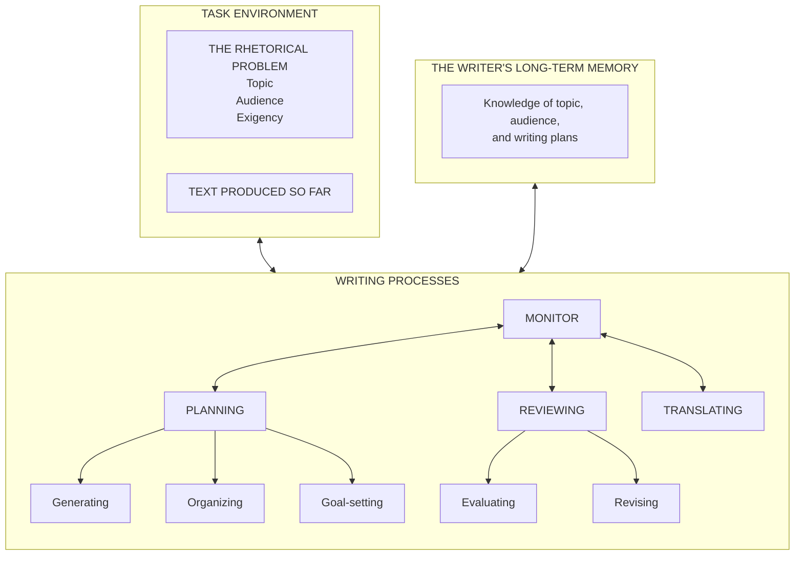

# Agentic CogWriter

Agentic CogWriter is a writing assistant that plans, drafts, and revises long-form text the way human writers do. The assistant keeps its goals, drafts, notes, and decision log as files in the directory where you write. Instead of generating text in one pass, the assistant revisits and rewrites its own plans and goals as the draft develops.

Agentic CogWriter implements the writing model in ["A Cognitive Process Theory of Writing"](https://www.jstor.org/stable/356600)[^1] by Linda Flower and John R. Hayes (1981). In that model, a monitor decides what to work on next. The monitor coordinates three writing processes as the writer works:

- Planning generates and organizes ideas and sets goals.
- Translating turns selected meanings into words.
- Reviewing evaluates and revises the text.

## How the writing model maps to the plugin

The architecture turns the writing model into a main skill, shared role skills, and file-backed project state.

The plugin ships a Claude Code adapter through [`plugin/.claude-plugin/plugin.json`](plugin/.claude-plugin/plugin.json) and [`plugin/agents/`](plugin/agents/), and a Codex adapter through [`plugin/.codex-plugin/plugin.json`](plugin/.codex-plugin/plugin.json) and [`plugin/skills/`](plugin/skills/).

The diagram below reproduces Figure 1, "Structure of the writing model," from the paper:



In the original figure, the arrows indicate information flow between processes, not a fixed left-to-right sequence[^1].

The table maps each model element to the plugin artifact that carries out the corresponding work. The rhetorical problem means the topic, audience, and reason for writing; exigency is the situation that makes writing necessary.

| Category | Figure 1 model element | Plugin artifact |
| --- | --- | --- |
| Task environment | Rhetorical problem and produced text | User project `.writing/assignment.md` and `.writing/draft.md` |
|  | Rhetorical problem: topic, audience, exigency | Sections in `.writing/assignment.md` |
|  | Produced text | User project `.writing/draft.md` |
| Writer's long-term memory | Topic and audience knowledge | User project `.writing/memory/` |
|  | Writing plans | Notes and plans in `.writing/memory/` plus `.writing/goals.md` |
| Planning | Process and embedded sub-processes | Shared [planning skill](plugin/skills/planning/SKILL.md) plus [Claude planner adapter](plugin/agents/planner.md) |
|  | Generating ideas | Planning skill's embedded Generate sub-process |
|  | Organizing ideas and presentation | Planning skill's embedded Organize sub-process |
|  | Goal-setting | Planning skill's embedded Goal-setting sub-process and `.writing/goals.md` |
| Translating | Process | Shared [translating skill](plugin/skills/translating/SKILL.md) plus [Claude translator adapter](plugin/agents/translator.md) |
| Reviewing | Process and embedded sub-processes | Shared [reviewing skill](plugin/skills/reviewing/SKILL.md) plus [Claude reviewer adapter](plugin/agents/reviewer.md) |
|  | Evaluating | Reviewing skill's embedded Evaluate sub-process |
|  | Revising | Reviewing skill's embedded Revise sub-process |
| Monitor | Orchestration role | [`plugin/skills/agentic-cog-writer/SKILL.md`](plugin/skills/agentic-cog-writer/SKILL.md), executed by the main agent |

Agentic CogWriter follows the recursive writing process described in ["A Cognitive Process Theory of Writing"](https://www.jstor.org/stable/356600)[^1]. Generate and Evaluate may interrupt any process. When a sub-goal resolves, control returns to its parent goal.

## Install from GitHub

Use the GitHub marketplace for the main install path. If the repository is private, GitHub installs require access to it. For development checkouts and personal Codex installs, read [`docs/installation.md`](./docs/installation.md).

### GitHub install for Claude Code

1. Add the repository marketplace:

   ```text
   /plugin marketplace add shunk031/agentic-cognitive-writing
   ```

2. Install the plugin from the marketplace:

   ```text
   /plugin install agentic-cognitive-writing@agentic-cognitive-writing-process
   ```

### GitHub install for Codex

1. From the writing project, add the repository marketplace:

   ```bash
   codex plugin marketplace add shunk031/agentic-cognitive-writing
   ```

2. Install the plugin from the marketplace:

   ```bash
   codex plugin add agentic-cognitive-writing@agentic-cognitive-writing-process
   ```

## Try it in a writing project

Agentic CogWriter turns your task into a file-backed writing session that you can inspect between turns.

1. Start in the project where the writing should live.
2. Invoke `/agentic-cognitive-writing:agentic-cog-writer` in Claude Code or `$agentic-cog-writer` in Codex. Describe the topic, audience, reason for writing, and desired result. The main skill asks for the rhetorical problem when needed, then coordinates the writing work through the project files.
3. Review the files the skill creates or updates:

   - `.writing/assignment.md` records the rhetorical problem and constraints.
   - `.writing/goals.md` records the hierarchical goal network and its history.
   - `.writing/draft.md` holds the growing text.
   - `.writing/memory/` holds topic knowledge, audience knowledge, and writing plans.
   - `.writing/trace/process.jsonl` records every process switch and goal change as one JSON line. See the [trace schema](plugin/skills/agentic-cog-writer/references/trace-jsonl-schema.md).

The monitor reads this state before each operation. You can inspect or edit it between turns.

## Compare the separate experiment variants

The [`cognitive-writing-experiments`](experiments/plugin/README.md) plugin packages two skills for controlled comparisons. Install the main `agentic-cognitive-writing` plugin first because both variants delegate to its shared role skills on both platforms.

- [`cognitive-writing-fixed-order`](experiments/plugin/skills/cognitive-writing-fixed-order/SKILL.md) runs Planning, then Translating, then Reviewing on each pass. Generate and Evaluate can interrupt, but the Monitor logs the interruption and returns to the prescribed order.
- [`cognitive-writing-no-goal-network`](experiments/plugin/skills/cognitive-writing-no-goal-network/SKILL.md) treats the assignment as one implicit objective, leaves `.writing/goals.md` untouched, and continues to trace process switches.

The variants' seed prompts live beside the skills in [`experiments/plugin/skills/`](experiments/plugin/skills/).

## Find code, research, and experiment material

The repository keeps the main plugin, experiment package, research, and protocol in separate directories.

- [`plugin/`](plugin/) contains the installable main plugin, including shared skills and adapter files.
- [`experiments/plugin/`](experiments/plugin/) contains the installable controlled-comparison variants.
- [`.claude-plugin/marketplace.json`](.claude-plugin/marketplace.json) and [`.agents/plugins/marketplace.json`](.agents/plugins/marketplace.json) define the local marketplace sources.
- The [`docs/research/skill-subagent-survey.md`](./docs/research/skill-subagent-survey.md) documents the research basis.
- The [`docs/experiments/protocol.md`](./docs/experiments/protocol.md) defines the comparison procedure.
- [`tools/validate-skills.sh`](tools/validate-skills.sh) runs the reproducible skill validators.
- [`plugin/skills/agentic-cog-writer/evals/evals.json`](plugin/skills/agentic-cog-writer/evals/evals.json) and the experiment skill eval files under [`experiments/plugin/skills/`](experiments/plugin/skills/) seed skill evaluations.

For offline use after installation, read [`plugin/README.md`](plugin/README.md); for research and experiment context, browse the linked documents above.

[^1]: Linda Flower and John R. Hayes. "A Cognitive Process Theory of Writing." College Composition and Communication 32(4), 1981, pp. 365-387.
    DOI: [10.58680/ccc198115885](https://doi.org/10.58680/ccc198115885) / JSTOR: [https://www.jstor.org/stable/356600](https://www.jstor.org/stable/356600)
