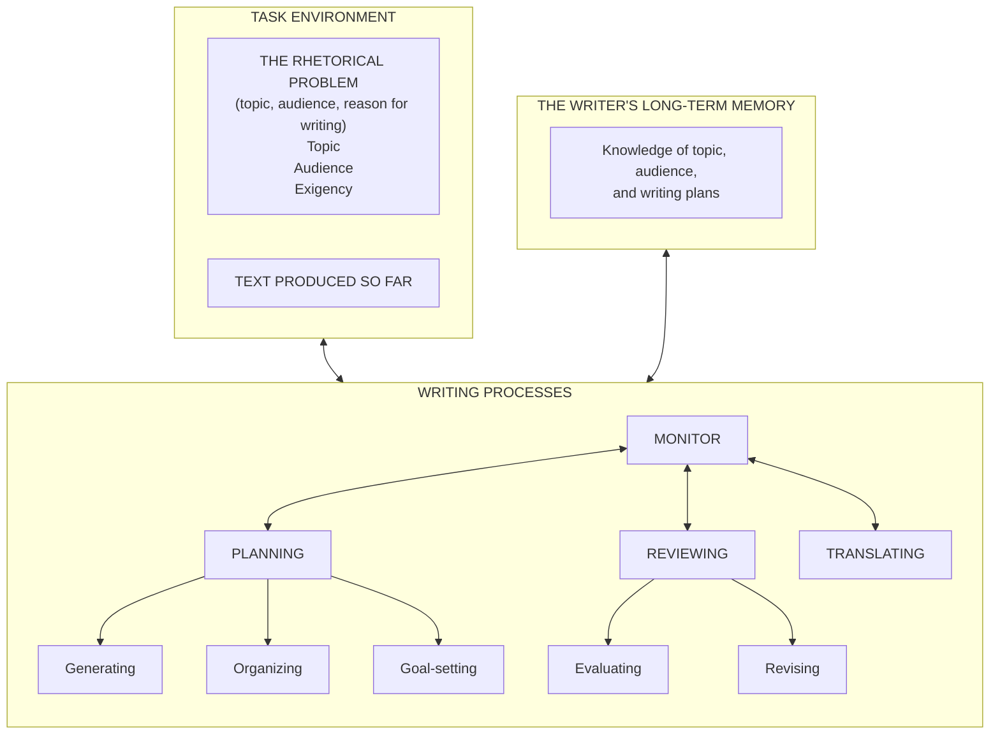

# Agentic cognitive writing

This project gives Claude Code and OpenAI Codex a writing assistant that plans, drafts, and revises recursively. It can revise its own plans and goals as the draft teaches it more, instead of generating text in one pass. It keeps the writing state as files in the writing project, the directory where you are writing, so you can inspect and continue the work.

It implements the writing model in ["A Cognitive Process Theory of Writing"](https://www.jstor.org/stable/356600)[^1] by Linda Flower and John R. Hayes (1981). In that model, a monitor is the part that decides what to work on next. It coordinates three writing processes as the writer works:

- Planning generates and organizes ideas and sets goals.
- Translating turns selected meanings into words.
- Reviewing evaluates and revises the text.

## Theory and architecture

The diagram below reproduces Figure 1, "Structure of the writing model," from the paper:



The arrows mean information flow, not a fixed left-to-right sequence, as the paper cautions in footnote 11[^1].

The table maps each model element to the plugin artifact that carries out the corresponding work.

| Category | Figure 1 model element | Plugin artifact |
| --- | --- | --- |
| Task environment | Task environment | User project `.writing/assignment.md` and `.writing/draft.md` |
|  | Rhetorical problem (the topic, the audience, and the reason for writing): topic, audience, exigency (the situation that makes the writing necessary) | Sections in `.writing/assignment.md` |
|  | Produced text | User project `.writing/draft.md` |
| Writer's long-term memory | Writer's long-term memory: topic and audience knowledge | User project `.writing/memory/` |
|  | Writer's long-term memory: writing plans | Notes and plans in `.writing/memory/` plus `.writing/goals.md` |
| Planning | Planning | Shared `plugin/skills/planning/SKILL.md` plus Claude adapter `plugin/agents/planner.md` |
|  | Generating ideas | Planning skill's embedded Generate sub-process |
|  | Organizing ideas and presentation | Planning skill's embedded Organize sub-process |
|  | Goal-setting | Planning skill's embedded Goal-setting sub-process and `.writing/goals.md` |
| Translating | Translating | Shared `plugin/skills/translating/SKILL.md` plus Claude adapter `plugin/agents/translator.md` |
| Reviewing | Reviewing | Shared `plugin/skills/reviewing/SKILL.md` plus Claude adapter `plugin/agents/reviewer.md` |
|  | Evaluating | Reviewing skill's embedded Evaluate sub-process |
|  | Revising | Reviewing skill's embedded Revise sub-process |
| Monitor | Monitor | `plugin/skills/cognitive-writing/SKILL.md`, executed by the main agent |

The main skill uses these processes recursively. Generate and Evaluate may interrupt any process. When a sub-goal resolves, control returns to its parent goal.

## Install

If the repository is private, GitHub installs require access to it.

### GitHub install for Claude Code

1. In Claude Code, add the repository marketplace:

   ```text
   /plugin marketplace add shunk031/agentic-cognitive-writing
   ```

2. Install the plugin from the marketplace:

   ```text
   /plugin install agentic-cognitive-writing@agentic-cognitive-writing-process
   ```

### GitHub install for Codex

1. From the writing project, add the repository marketplace:

   ```bash
   codex plugin marketplace add shunk031/agentic-cognitive-writing
   ```

2. Install the plugin from the marketplace:

   ```bash
   codex plugin add agentic-cognitive-writing@agentic-cognitive-writing-process
   ```

### Development install from a checkout in Claude Code

1. Change to the repository root.
2. Add the local marketplace:

   ```text
   /plugin marketplace add .
   ```

3. Install the plugin:

   ```text
   /plugin install agentic-cognitive-writing@agentic-cognitive-writing-process
   ```

4. To try it without installing, load the plugin directory directly:

   ```bash
   claude --plugin-dir "$PWD/plugin"
   ```

### Development install from a checkout in Codex

1. Change to the repository root. The repository includes `.agents/plugins/marketplace.json` with a local `./plugin` source entry.
2. Add the local marketplace:

   ```bash
   codex plugin marketplace add .
   ```

3. Install the plugin:

   ```bash
   codex plugin add agentic-cognitive-writing@agentic-cognitive-writing-process
   ```

### Personal Codex install

1. Copy the plugin directory to `~/.codex/plugins/agentic-cognitive-writing`.
2. Create `~/.agents/plugins/marketplace.json`:

   ```json
   {
     "name": "agentic-cognitive-writing-process",
     "plugins": [
       {
         "name": "agentic-cognitive-writing",
         "source": {
           "source": "local",
           "path": "../../.codex/plugins/agentic-cognitive-writing"
         }
       }
     ]
   }
   ```

3. Add that marketplace and install the plugin:

   ```bash
   codex plugin marketplace add ~/.agents/plugins
   codex plugin add agentic-cognitive-writing@agentic-cognitive-writing-process
   ```

## Use the plugin

Open a writing project and invoke `/agentic-cognitive-writing:cognitive-writing` in Claude Code or `$cognitive-writing` in Codex. The main skill asks for the rhetorical problem when needed, then coordinates the writing work through the project files.

## Quickstart

1. Start in the project where the writing should live.
2. Invoke the main skill and describe:

   - the topic
   - the audience
   - the reason for writing
   - the desired result
3. Review the files the skill creates or updates:

   - `.writing/assignment.md` records the rhetorical problem and constraints.
   - `.writing/goals.md` records the hierarchical goal network and its history.
   - `.writing/draft.md` holds the growing text.
   - `.writing/memory/` holds topic knowledge, audience knowledge, and writing plans.
   - `.writing/trace/process.jsonl` records every process switch and goal change as one JSON line. See the [trace schema](plugin/skills/cognitive-writing/references/trace-jsonl-schema.md).

The monitor reads this state before each operation. You can inspect or edit it between turns.

## Experiment variants

The plugin includes two sibling skills for controlled comparisons. They reuse the shared role skills and Claude adapters. They keep the project state and trace rules. They are not recommended defaults.

- [`cognitive-writing-fixed-order`](plugin/skills/cognitive-writing-fixed-order/SKILL.md) runs Planning, then Translating, then Reviewing on each pass. Generate and Evaluate can interrupt, but the Monitor logs the interruption and returns to the prescribed order.
- [`cognitive-writing-no-goal-network`](plugin/skills/cognitive-writing-no-goal-network/SKILL.md) treats the assignment as one implicit objective, leaves `.writing/goals.md` untouched, and continues to trace process switches.

Select a variant only when a comparison is needed. Their seed prompts live beside the skills in `plugin/skills/`.

## Repository layout

- `plugin/` contains the installable Claude Code and Codex plugin, including shared skills and Claude adapters.
- `.claude-plugin/marketplace.json` and `.agents/plugins/marketplace.json` define the local marketplace sources.
- `docs/research/` contains research notes on the [research branches](https://github.com/shunk031/agentic-cognitive-writing/tree/research/skill-subagent-survey/docs/research).
- `docs/experiments/` contains experiment material on the [experiment branch](https://github.com/shunk031/agentic-cognitive-writing/tree/docs/experiment-protocol/docs/experiments).
- `tools/validate-skills.sh` runs the reproducible skill validators.
- `plugin/skills/*/evals/evals.json` contains skill eval seeds.

For offline use after installation, read [`plugin/README.md`](plugin/README.md). For research and experiment context, browse the linked branch directories above.

[^1]: Linda Flower and John R. Hayes. "A Cognitive Process Theory of Writing." College Composition and Communication 32(4), 1981, pp. 365-387. DOI: [10.58680/ccc198115885](https://doi.org/10.58680/ccc198115885). JSTOR: [https://www.jstor.org/stable/356600](https://www.jstor.org/stable/356600).
