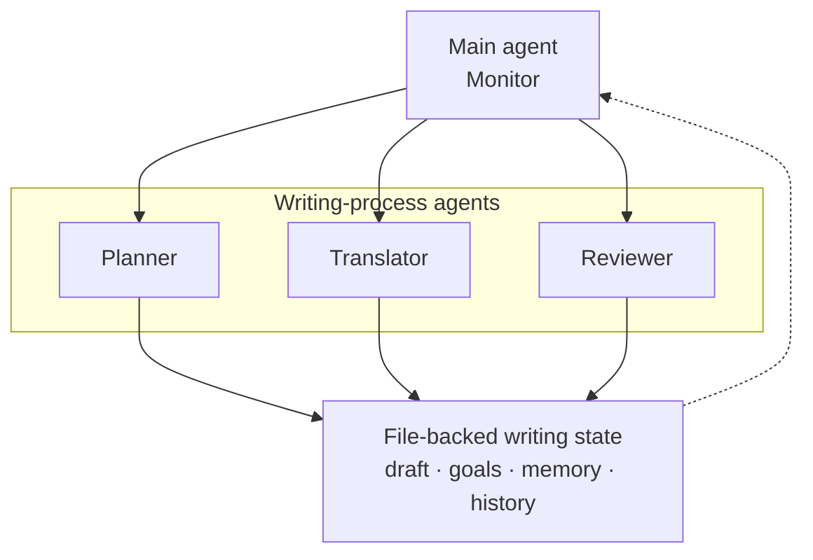

# Agentic CogWriter

**Agentic CogWriter** is a writing assistant that plans, drafts, and revises long-form text through an explicit cognitive-process architecture.

Instead of producing a document in a single pass, Agentic CogWriter maintains the evolving state of the writing process—including the rhetorical problem, current draft, writing goals, memory, and process history—and repeatedly decides what kind of writing operation should happen next.

[Get started](installation.md){ .md-button .md-button--primary }
[View on GitHub](https://github.com/shunk031/agentic-cognitive-writing){ .md-button }

## Cognitive writing as an agent process

Agentic CogWriter operationalizes the writing model proposed by Flower and Hayes in *A Cognitive Process Theory of Writing*.

A `Monitor` coordinates three writing processes:

- **Planning** generates and organizes ideas and develops writing goals.
- **Translating** turns selected meanings and goals into text.
- **Reviewing** evaluates the evolving document and revises it.

The processes are not executed as a fixed pipeline. The `Monitor` can move between them as composition develops, while the system maintains an evolving hierarchical goal network.

[Read how the cognitive model maps to the system →](theory-mapping.md)

## Explore the project

-   :material-rocket-launch: **Get started**

    ---

    Install Agentic CogWriter for Claude Code or Codex and start a file-backed writing session.

    [Installation →](installation.md)

-   :material-brain: **How it works**

    ---

    See how the `Monitor`, `Planning`, `Translating`, `Reviewing`, writing state, and goal network map to the cognitive-process theory.

    [Cognitive process architecture →](theory-mapping.md)

-   :material-flask-outline: **Research**

    ---

    Review the research foundations behind the agent architecture, skill/subagent design, and writing evaluation methodology.

    [Research overview →](research/index.md)

-   :material-chart-box-outline: **Experiments**

    ---

    See the controlled comparison, ablations, benchmarks, evaluation protocol, and process-analysis plan.

    [Experiment overview →](experiments/index.md)

