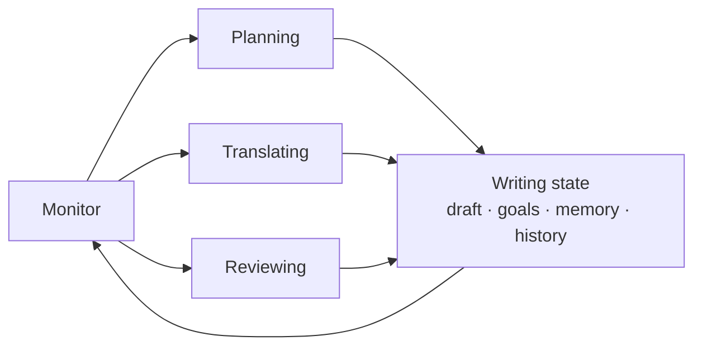

AGENTIC COGNITIVE WRITING

# Agentic CogWriter

Long-form writing as an adaptive cognitive process.

Agentic CogWriter is a writing assistant that **plans, drafts, reviews, and adapts** while maintaining the evolving state of a long-form writing project. Instead of committing to a fixed generation pipeline, it repeatedly decides what writing operation should happen next.

[Get started](installation.md){ .md-button .md-button--primary }
[How it works](theory-mapping.md){ .md-button }
[View on GitHub](https://github.com/shunk031/agentic-cognitive-writing){ .md-button }

  <strong>Planning</strong>
  ↔
  <strong>Translating</strong>
  ↔
  <strong>Reviewing</strong>
  coordinated by the <strong>Monitor</strong>

COGNITIVE PROCESS ARCHITECTURE

## The Monitor decides what happens next

Agentic CogWriter operationalizes the writing model proposed by Flower and Hayes in *A Cognitive Process Theory of Writing*. A `Monitor` coordinates `Planning`, `Translating`, and `Reviewing` rather than executing them as a fixed sequence.

Each process updates a shared writing state containing the draft, goals, memory, and process history. That evolving state then informs the next decision by the `Monitor`.

[Read the cognitive-process mapping →](theory-mapping.md)

## Explore the project

-   :material-rocket-launch: **Get started**

    ---

    Install Agentic CogWriter for Claude Code or Codex and start a file-backed writing session.

    [Installation →](installation.md)

-   :material-brain: **How it works**

    ---

    See how the `Monitor`, `Planning`, `Translating`, `Reviewing`, writing state, and goal network map to the cognitive-process theory.

    [Cognitive process architecture →](theory-mapping.md)

-   :material-flask-outline: **Research**

    ---

    Review the research foundations behind the agent architecture, skill/subagent design, and writing evaluation methodology.

    [Research overview →](research/index.md)

-   :material-chart-box-outline: **Experiments**

    ---

    See the controlled comparison, ablations, benchmarks, evaluation protocol, and process-analysis plan.

    [Experiment overview →](experiments/index.md)

