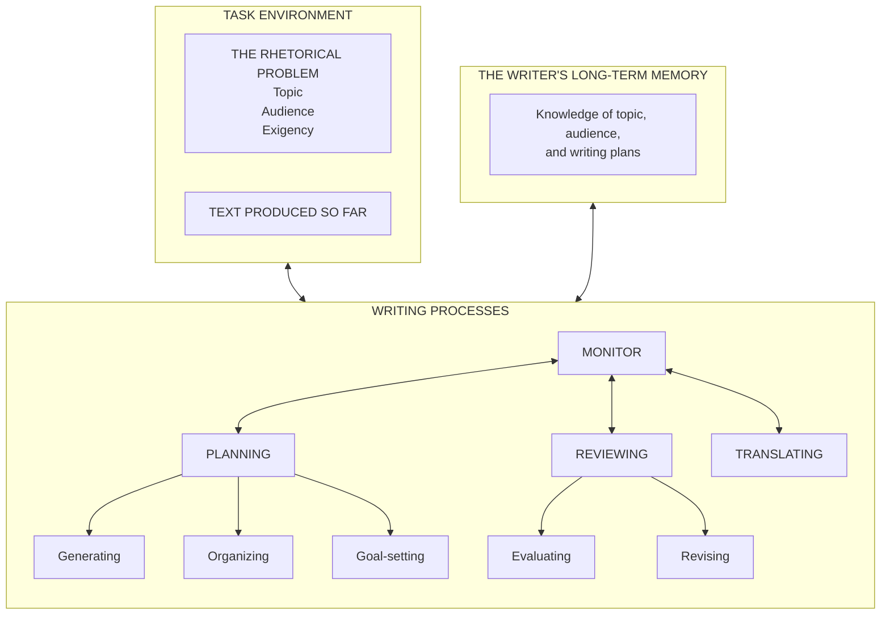

# How the theory maps to Agentic CogWriter

Agentic CogWriter maps the writing model to a main skill, shared role skills, and file-backed project state.

The plugin ships a Claude Code adapter through [`plugin/.claude-plugin/plugin.json`](../plugin/.claude-plugin/plugin.json) and [`plugin/agents/`](../plugin/agents/), and a Codex adapter through [`plugin/.codex-plugin/plugin.json`](../plugin/.codex-plugin/plugin.json) and [`plugin/skills/`](../plugin/skills/).

The diagram below reproduces Figure 1, "Structure of the writing model," from ["A Cognitive Process Theory of Writing"](https://www.jstor.org/stable/356600)[^1]:

Footnote 11 of ["A Cognitive Process Theory of Writing"](https://www.jstor.org/stable/356600)[^1] explains that the original figure's arrows indicate information flow between processes, not a fixed left-to-right sequence.

The table maps each model element to the plugin artifact that carries out the corresponding work. The rhetorical problem means the topic, audience, and reason for writing; exigency is the situation that makes writing necessary.

| Category | Figure 1 model element | Plugin artifact |
| --- | --- | --- |
| Task environment | Rhetorical problem and produced text | User project `.writing/assignment.md` and `.writing/draft.md` |
|  | Rhetorical problem: topic, audience, exigency | Sections in `.writing/assignment.md` |
|  | Produced text | User project `.writing/draft.md` |
| Writer's long-term memory | Topic and audience knowledge | User project `.writing/memory/` |
|  | Writing plans | Notes and plans in `.writing/memory/` plus `.writing/goals.md` |
| `Planning` | Process and embedded sub-processes | Shared [planning skill](../plugin/skills/planning/SKILL.md) plus [Claude planner adapter](../plugin/agents/planner.md) |
|  | Generating ideas | `Planning` skill's embedded Generate sub-process |
|  | Organizing ideas and presentation | `Planning` skill's embedded Organize sub-process |
|  | Goal-setting | `Planning` skill's embedded Goal-setting sub-process and `.writing/goals.md` |
| `Translating` | Process | Shared [translating skill](../plugin/skills/translating/SKILL.md) plus [Claude translator adapter](../plugin/agents/translator.md) |
| `Reviewing` | Process and embedded sub-processes | Shared [reviewing skill](../plugin/skills/reviewing/SKILL.md) plus [Claude reviewer adapter](../plugin/agents/reviewer.md) |
|  | Evaluating | `Reviewing` skill's embedded Evaluate sub-process |
|  | Revising | `Reviewing` skill's embedded Revise sub-process |
| `Monitor` | Orchestration role | [`plugin/skills/agentic-cog-writer/SKILL.md`](../plugin/skills/agentic-cog-writer/SKILL.md), executed by the main agent |

Agentic CogWriter follows the recursive writing process described in ["A Cognitive Process Theory of Writing"](https://www.jstor.org/stable/356600)[^1]. Generate and Evaluate may interrupt any process. When a sub-goal resolves, control returns to its parent goal.

[^1]: Linda Flower and John R. Hayes. "A Cognitive Process Theory of Writing." College Composition and Communication 32(4), 1981, pp. 365-387.
    DOI: [10.58680/ccc198115885](https://doi.org/10.58680/ccc198115885) / JSTOR: [https://www.jstor.org/stable/356600](https://www.jstor.org/stable/356600)
