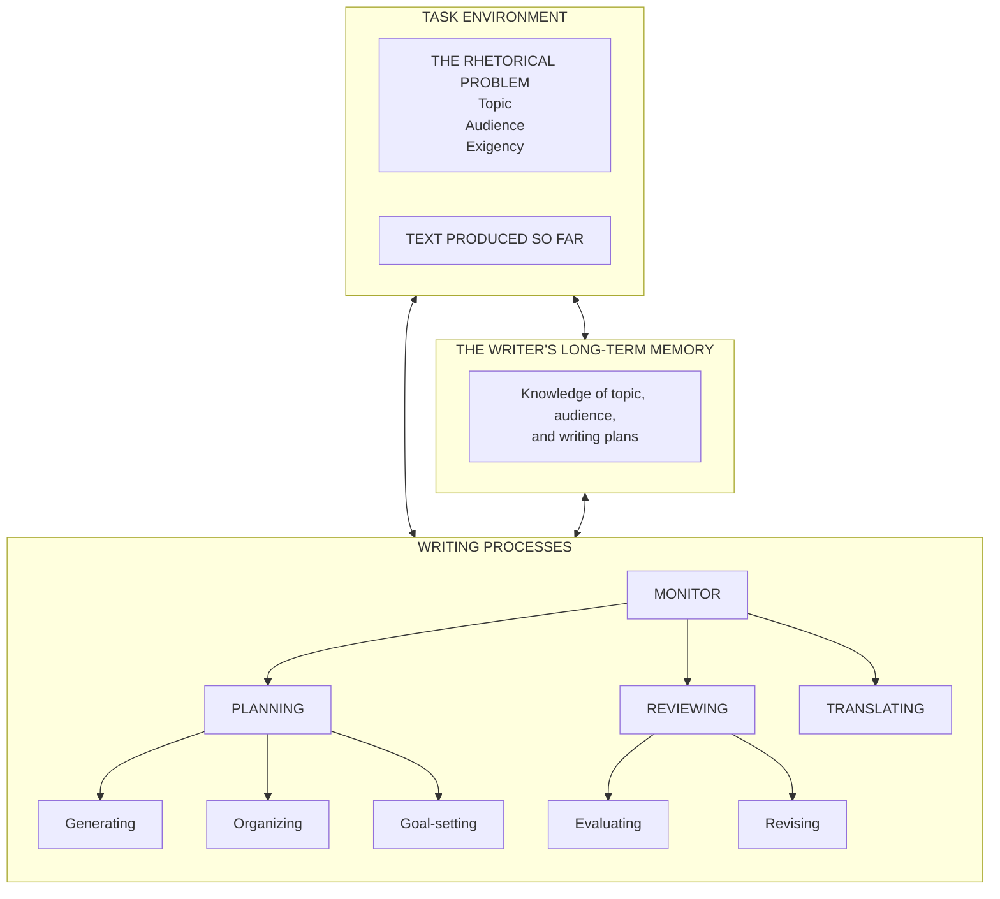

# Agentic cognitive writing

`agentic-cognitive-writing` is a cross-platform plugin skeleton for Claude Code and OpenAI Codex. It operationalizes ["A Cognitive Process Theory of Writing"](https://www.jstor.org/stable/356600) by Flower and Hayes (1981)[^1] as a Monitor skill that coordinates Planning, Translating, and Reviewing. The plugin keeps the writing project's task environment and long-term memory in files owned by the user.

## Install

### Claude Code

For a local marketplace install, run Claude Code from the repository root and add the included marketplace:

```text
/plugin marketplace add .
/plugin install agentic-cognitive-writing@agentic-cognitive-writing-process
```

For a one-off local session, point Claude Code at the distributable plugin directory:

```bash
claude --plugin-dir /absolute/path/to/agentic-cognitive-writing-process/plugin
```

Claude loads the manifest from `plugin/.claude-plugin/plugin.json`, discovers the component directories at the plugin root, and namespaces the skill as `/agentic-cognitive-writing:cognitive-writing`.

### OpenAI Codex

Codex reads the plugin manifest at `plugin/.codex-plugin/plugin.json`. For a local repo marketplace, copy the distributable directory into the host repository's plugin directory, then add a Codex marketplace file:

```bash
mkdir -p ./plugins
cp -R /absolute/path/to/agentic-cognitive-writing-process/plugin ./plugins/agentic-cognitive-writing
mkdir -p ./.agents/plugins
```

Create `$REPO_ROOT/.agents/plugins/marketplace.json` with an entry like this:

```json
{
  "name": "local-writing-plugins",
  "interface": { "displayName": "Local writing plugins" },
  "plugins": [
    {
      "name": "agentic-cognitive-writing",
      "source": { "source": "local", "path": "./plugins/agentic-cognitive-writing" },
      "policy": { "installation": "AVAILABLE", "authentication": "ON_INSTALL" },
      "category": "Productivity"
    }
  ]
}
```

Register the marketplace, then install the plugin as a separate step. The Codex CLI help confirms the `PLUGIN@MARKETPLACE` selector syntax:

```bash
codex plugin marketplace add .
codex plugin add agentic-cognitive-writing@local-writing-plugins
```

You can invoke the shared skill explicitly in Codex as `$cognitive-writing`. You can also select the plugin from the Codex or ChatGPT desktop Plugins Directory after registering the marketplace. For a personal install, copy the plugin to `~/.codex/plugins/agentic-cognitive-writing` and use `~/.agents/plugins/marketplace.json` with `"path": "../../.codex/plugins/agentic-cognitive-writing"`; that relative path reaches the copied plugin from the marketplace file's directory. Restart the desktop app after changing a local marketplace. Codex uses the shared `plugin/skills/` tree; the Claude-only `plugin/agents/*.md` files are thin adapters that preload the same role skills, while the skill asks Codex to delegate those roles to native Codex subagents.

## Theory-to-architecture mapping

The mapping interprets Figure 1 of Flower and Hayes. It is an implementation of the theory, not a claim that the paper specifies plugin files.

| Category | Figure 1 model element | Plugin artifact |
| --- | --- | --- |
| Task environment | Task environment | User project `.writing/assignment.md` and `.writing/draft.md` |
| Task environment | Rhetorical problem: topic, audience, exigency | Sections in `.writing/assignment.md` |
| Task environment | Produced text | User project `.writing/draft.md` |
| Writer's long-term memory | Writer's long-term memory: topic and audience knowledge | User project `.writing/memory/` |
| Writer's long-term memory | Writer's long-term memory: writing plans | Notes and plans in `.writing/memory/` plus `.writing/goals.md` |
| Planning | Planning | Shared `plugin/skills/planning/SKILL.md` plus Claude adapter `plugin/agents/planner.md` |
| Planning | Generating ideas | Planning skill's embedded Generate sub-process |
| Planning | Organizing ideas and presentation | Planning skill's embedded Organize sub-process |
| Planning | Goal-setting | Planning skill's embedded Goal-setting sub-process and `.writing/goals.md` |
| Translating | Translating | Shared `plugin/skills/translating/SKILL.md` plus Claude adapter `plugin/agents/translator.md` |
| Reviewing | Reviewing | Shared `plugin/skills/reviewing/SKILL.md` plus Claude adapter `plugin/agents/reviewer.md` |
| Reviewing | Evaluating | Reviewing skill's embedded Evaluate sub-process |
| Reviewing | Revising | Reviewing skill's embedded Revise sub-process |
| Monitor | Monitor | `plugin/skills/cognitive-writing/SKILL.md`, executed by the main agent |

The Monitor treats these processes as a recursive toolkit. Generate and Evaluate may interrupt any process, and a resolved sub-goal returns control to its parent goal.



Figure 1's arrows represent information flow, not a fixed left-to-right sequence, as Flower and Hayes caution in footnote 11.

Claude Code cannot combine `disable-model-invocation` with subagent skill preloading, so this plugin uses internal-use descriptions for the three Claude role skills and hard implicit-invocation suppression through Codex `agents/openai.yaml` policy.[^7][^8]

## User project state

The plugin creates or maintains this layout in the project where it is used:

```text
.writing/
├── assignment.md       # topic, audience, exigency, writer's goals, constraints
├── goals.md            # hierarchical goal network and history
├── draft.md            # growing text
├── memory/
│   ├── topic.md        # optional topic knowledge
│   ├── audience.md     # optional audience knowledge
│   └── plans.md        # optional reusable writing plans
└── trace/
    └── process.jsonl   # append-only process log
```

The plugin has no runtime dependency on files elsewhere in this repository. It does create and maintain `.writing/` in the user's writing project. That directory belongs to the user and should not be committed unless the user chooses to share the writing process.

See [`skills/cognitive-writing/references/goals-format.md`](skills/cognitive-writing/references/goals-format.md) for goal notation and [`skills/cognitive-writing/references/ablation-variants.md`](skills/cognitive-writing/references/ablation-variants.md) for experiment settings.

## Trace JSONL schema

The Monitor appends one valid JSON object per line to `.writing/trace/process.jsonl`. Each line records the responsible actor, process, decision, evidence, and open uncertainty. The required fields are:

| Field | Meaning |
| --- | --- |
| `timestamp` | ISO 8601 timestamp with timezone |
| `event_type` | `process_switch`, `goal_created`, `goal_developed`, or `goal_regenerated` |
| `responsible_agent` | `monitor`, `planner`, `translator`, `reviewer`, or `user` |
| `process` | Process that owns the decision |
| `decision` | Action or rationale in plain language |
| `evidence` | Array of concrete supporting observations or project-relative files |
| `open_uncertainty` | Array of unresolved questions or unsupported claims |

Process switches also include `from_process` and `to_process`. Goal events include `goal_id` and `parent_goal_id`. Optional `artifacts` lists changed files and `ablation` names the active experiment variant.

Example line:

```json
{"timestamp":"2026-01-15T09:00:00+09:00","event_type":"process_switch","responsible_agent":"monitor","process":"planning","from_process":"translating","to_process":"reviewing","decision":"Review the opening after it conflicted with the audience goal.","evidence":[".writing/draft.md: opening uses internal jargon",".writing/goals.md: G1 requires a first-time reader explanation"],"open_uncertainty":["Whether to keep the technical term with a definition"],"goal_id":"G1","parent_goal_id":"G0","artifacts":[".writing/draft.md",".writing/goals.md"]}
```

The field-by-field contract lives in [`skills/cognitive-writing/references/trace-jsonl-schema.md`](skills/cognitive-writing/references/trace-jsonl-schema.md).

## Evaluation seed

The seed prompts for realistic writing tasks are in [`skills/cognitive-writing/evals/evals.json`](skills/cognitive-writing/evals/evals.json). They cover initial planning and drafting, review with possible goal regeneration, and the no-goal-network ablation.

## Sources and scope

The plugin follows the shared `SKILL.md` format supported by both hosts.[^2] Claude plugin structure and local marketplace behavior are documented in the Claude Code plugins and marketplace references.[^3] Codex plugin packaging and local marketplace behavior are documented in OpenAI's plugin and skill packaging guides.[^4] The direct implementation patterns consulted were Anthropic's `feature-dev` plugin manifest and `code-explorer` agent,[^5] plus OpenAI's `build-web-apps` Codex manifest and `frontend-app-builder` skill.[^6]

[^1]: Linda Flower and John R. Hayes. "A Cognitive Process Theory of Writing." College Composition and Communication 32(4), 1981, pp. 365-387. Canonical DOI: [10.58680/ccc198115885](https://doi.org/10.58680/ccc198115885). The DOI endpoint returned HTTP 403 in this environment, so the title above links to the resolvable [JSTOR record](https://www.jstor.org/stable/356600).
[^2]: [Claude Code skills documentation](https://code.claude.com/docs/en/skills) and [OpenAI Codex skill documentation](https://developers.openai.com/codex/build-skills).
[^3]: [Claude Code plugins reference](https://code.claude.com/docs/en/plugins-reference) and [Claude Code marketplace documentation](https://code.claude.com/docs/en/plugin-marketplaces).
[^4]: [OpenAI plugin packaging guide](https://developers.openai.com/plugins/build/plugins) and [Codex skill packaging guide](https://developers.openai.com/plugins/build/skills).
[^5]: Anthropic's [`feature-dev` plugin manifest](https://github.com/anthropics/claude-code/blob/main/plugins/feature-dev/.claude-plugin/plugin.json) and [`code-explorer` agent](https://github.com/anthropics/claude-code/blob/main/plugins/feature-dev/agents/code-explorer.md).
[^6]: OpenAI's [`build-web-apps` Codex manifest](https://github.com/openai/plugins/blob/main/plugins/build-web-apps/.codex-plugin/plugin.json) and [`frontend-app-builder` skill](https://github.com/openai/plugins/blob/main/plugins/build-web-apps/skills/frontend-app-builder/SKILL.md).
[^7]: [Claude Code skill frontmatter reference](https://code.claude.com/docs/en/skills#frontmatter-reference).
[^8]: [Claude Code subagent skill preloading](https://code.claude.com/docs/en/sub-agents#preload-skills-into-subagents).
